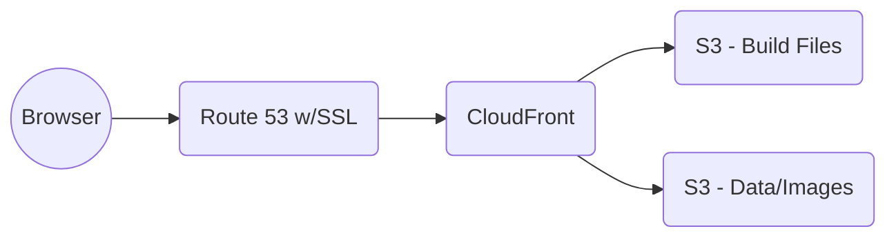

# Model Homes of the Golden Gate International Exposition, 1939-40

> Documentation for the **React frontend** of [ggiemh.com](https://ggiemh.com).

## About

### Description

`ggiemh.com` is a content-driven website that documents the rediscovered "model homes" built around the San Francisco Bay Area for the Model Home project of the Golden Gate International Exposition, a World's Fair held on Treasure Island in 1939-40. This application emphasizes solid architecture, reliability testing, improved performance via caching, and automated cloud deployment.

### Features Overview

- Website and images served via AWS CloudFront CDN for high performance and low latency.
- Fetched data is cached to prevent redundant requests and load pages instantly.
- Fully responsive, accessible UI.
- Images rendered in efficient preprocessed AVIF and WebP formats.
- Integration and unit tests ensure reliability.
- Automated cloud deployment via GitHub Actions CI/CD pipeline.

### Testing

UI testing is carried out using Vitest and RTL. Integration test coverage includes high-level routing and page rendering. Tests ensure basic React Router functionality and ability of users to access and correctly use top-level navigation elements from anywhere in the application. Unit tests focus on business logic such as list sorting.

### Tech Stack

- Language: `TypeScript`
- UI Library: `React`
- Components & Styling: `Radix` w/ `shadcn`, `Tailwind CSS`
- Routing Library: `React Router`
- Fetch Library: `Tanstack Query`
- Image Processing: `sharp`
- Lint &amp; Format: `Biome`, `Husky` (pre-commit)
- Testing: `Vitest`, `React Testing Library`
- Build Tool: `Vite`
- CI: `GitHub Actions`
- Cloud Deploy: `S3`, `CloudFront`, `Route 53`, `ACM`

## Deployment

`ggiemh.com` is a static frontend hosted on S3 from build files generated by Vite. Build files and image assets are managed in separate S3 buckets. A CloudFront distribution routes requests between the build and assets buckets as needed. CloudFront automatically caches resources to increase response time and avoid repeat direct requests to S3. 

### CI/CD

Continuous integration is managed via a GitHub Actions deployment workflow. New and updated pull requests trigger a workflow that lints and tests the codebase, ensuring reliability before merging new code into the `main` branch.

The pipeline will continue to be developed with a continuous delivery workflow to automatically test, create, and deploy new builds to the cloud.

### SSL

The site domain `ggiemh.com` is managed by Route 53. SSL certification is configured for the domain with AWS Certificate Manager.

### Request path



## UI

### Data Fetching

Using Tanstack Query, fetched data is cached in the user's browser. Once a route's data has been cached, any repeat requests to the webpage where the route originates will prompt TQ to pull the data from the cache rather than send another request to the server. Because the website has infrequent updates, the default "stale" time (i.e., the time until the route's data is considered outdated and needing a refetch) for routes is a fairly long 24 hours.

In addition to reducing unnecessary requests to `ggiemh.com`'s REST API, this caching strategy greatly reduces (or outright eliminates) page load time.

### HTML Parsing

Website content is fetched from a REST API, including raw HTML strings. Each string is sanitized using `dompurify` (a defensive measure to prevent Cross-Site Scripting (XSS) attacks, even though none of the content is user-generated) then parsed for rendering using `html-react-parser`.

`<a>` tags are parsed and replaced with React Router `Link` components to utilize client-side routing. 

### Images

Each of the 28 model homes on `ggiemh.com` are represented by one or more images. Each image has been preprocessed by `sharp`, a Node.js image processing library, into multiple AVIF and WebP files of different sizes. Using the HTML `picture` element, the browser fetches the best available size and format for their device and display. A JPEG fallback image is also provided if the browser cannot display AVIF or WebP.

Images are cached and served via CloudFront CDN.

"Lazy loading" of images, a process that delays loading images until they are actually in the user's display, is utilized to improve performance and load times.

While image data loads, placeholder "Loading..." elements provide continuity and prevent layout shift.

## Additional Information

### Links

- [Backend repository](https://github.com/tdkent/ggiemh-backend)
- [Visit ggiemh.com](https://ggiemh.com)

### Local Development

> How to run the application locally. Requires Node.

```bash
# Install deps and run
npm install
npm run dev

# Lint and fix
npm run lint:fix

# Run tests
npm run test

# Build
npm run build
```

#### Environment variables

```
.env

VITE_BACKEND_URL=http://localhost:<PORT>
VITE_ASSETS_URL=https://ggiemh.com/assets
```